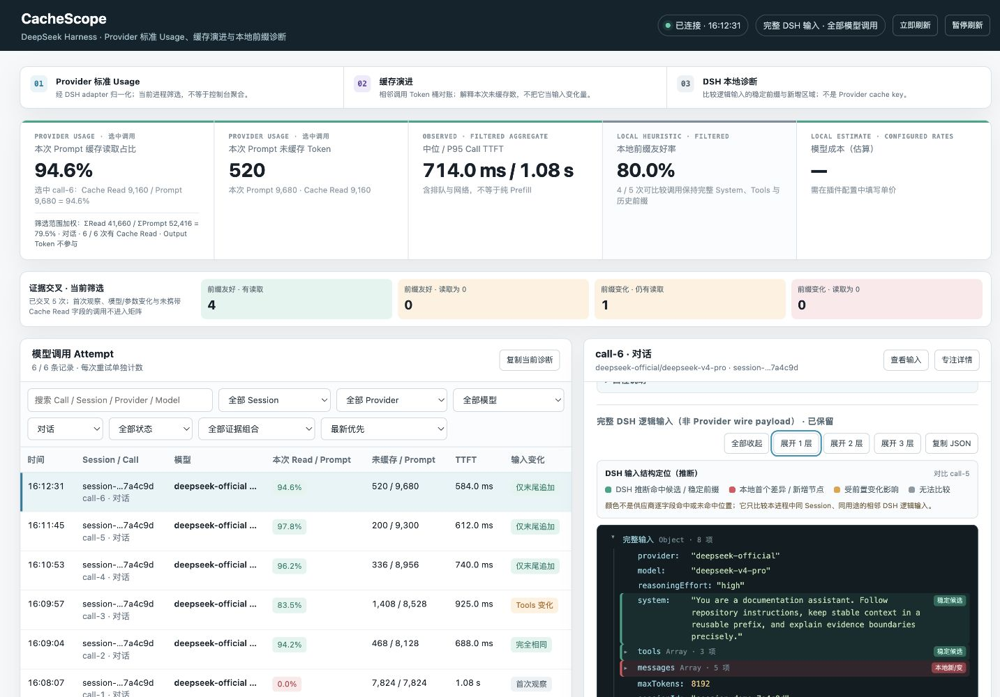

# CacheScope

English | [中文](README.zh.md)

**See how much prompt cache a model call used—and what changed when it missed.**

CacheScope puts provider-reported cache-token usage beside the DSH-side difference between adjacent logical inputs. It records observed `llm/stream` attempts and serves a desktop dashboard without modifying model requests or registering a model-visible tool.



*Dashboard shown with synthetic sample calls. Provider figures are illustrative.*

## Install

Install the bundle into the Web profile and start DSH:

```sh
dsh plugin --profile web add @kober-basket/dsh-cachescope
dsh web
```

Open [http://127.0.0.1:3080/cachescope](http://127.0.0.1:3080/cachescope).

> **Prompt privacy:** the installed bundle enables `captureInput: full`. By default it can retain the latest 12 complete logical inputs in DSH process memory, up to 2,000,000 UTF-8 JSON bytes each. Use the metadata-only configuration below before sending sensitive prompts if complete-input inspection is unnecessary.

```yaml
- id: cachescope
  name: '@kober-basket/dsh-cachescope'
  config:
    captureInput: metadata
```

Restart DSH after changing the profile.

## Quick start: compare two turns

1. Send a first message in a DSH conversation. This creates the local comparison baseline.
2. Send a second message in the same Session without changing the provider, model, System Prompt, or enabled tools.
3. Select the second conversation call in CacheScope. Read its Provider Cache Read ratio at the top, then inspect the adjacent-input diagnosis and colored input tree.

The first observed call has no local comparison baseline. Cache Read also remains unreported when the provider adapter does not carry that usage field; a missing field is not treated as zero.

The table initially filters to conversations. Clear the purpose filter to include title generation, compaction, and direct model calls.

## What you can diagnose

- How much of one call's Prompt was reported as Cache Read, alongside uncached input, Cache Write, output, and a token-weighted aggregate over currently retained calls matching the active filters.
- Why the reported uncached bucket changed between adjacent comparable calls: `current uncached = previous uncached + ΔPrompt - ΔCache Read - ΔCache Write`.
- Whether the DSH logical input stayed identical, grew only at the end, changed System or Tools, changed routing or options, or rewrote message history.
- Which input regions are stable-prefix candidates, the first local difference, downstream regions, or regions without a comparable baseline.
- Call TTFT, median and P95 Call TTFT, total duration, status, purpose, provider, model, retries, and optional local cost estimates.
- Session, provider, model, purpose, lifecycle, and evidence filters; diagnostic sorting; live following; and copyable metadata for issues or discussions.

## How to read the evidence

| Evidence | Source and meaning | Does not mean |
|---|---|---|
| Selected `Cache Read / Prompt` | Provider usage normalized by the DSH adapter for one call. | A local diff percentage or the DeepSeek console aggregate. |
| Filtered weighted ratio | `Σ Cache Read / Σ Prompt` across currently retained, visible calls that reported Cache Read. | The provider console's potentially different time window and call population. |
| Uncached input | The adapter's normalized uncached input-token bucket. | Response length or the number of newly added or changed tokens. |
| Input-tree colors | Comparison with the preceding in-process call from the same Session and purpose. | Proof that the provider used a region as a cache key or returned those exact tokens from cache. |
| Token reconciliation | Arithmetic explaining how adjacent reported token buckets changed. | A provider cache key, token offsets, or the cause of a cache decision. |
| Call TTFT | Time from CacheScope beginning stream iteration to the first non-empty token. | Isolated provider Prefill time; queueing and network time are included. |

Output tokens enter neither cache ratio. The input hierarchy represents the DSH logical model input captured before provider-specific serialization, so it can differ from the exact wire payload.

## Configuration

The Schema default applies when the plugin is mounted directly. The published installable bundle overrides only `captureInput` to `full`; the profile's own patch remains authoritative.

| Key | Schema default | Installed bundle | Effect |
|---|---:|---:|---|
| `captureInput` | `metadata` | `full` | Retain fingerprints and metrics only, or bounded complete logical inputs. |
| `maxAttempts` | `500` | `500` | Maximum attempts retained in process memory. Older attempts are evicted. |
| `rawRetentionAttempts` | `12` | `12` | Maximum recent attempts that may retain complete inputs. |
| `maxRawInputBytes` | `2000000` | `2000000` | Maximum UTF-8 JSON bytes retained for one complete input. |
| `refreshMs` | `1500` | `1500` | Dashboard polling interval in milliseconds. |
| `logAttempts` | `true` | `true` | Print one metadata-only summary after each attempt. |
| `includeAuxiliary` | `true` | `true` | Include compaction, title generation, and direct calls. |
| `dashboard` | `true` | `true` | Register the dashboard when the WebServer is bound to loopback. |
| `pricing` | unset | unset | Optional currency and per-million-token rates for local cost estimates. |

### Optional pricing

Supply all four rates from your current provider price sheet; CacheScope does not ship or update a pricing table.

```yaml
- id: cachescope
  name: '@kober-basket/dsh-cachescope'
  config:
    pricing:
      currency: CNY
      uncachedInputPerMillion: 0 # replace with your current rate
      cacheReadPerMillion: 0 # replace with your current rate
      cacheWritePerMillion: 0 # replace with your current rate
      outputPerMillion: 0 # replace with your current rate
```

Replace every zero before relying on cost estimates. CacheScope uses normalized usage fields and the values you supply; the example contains no current or recommended provider rates.

## Data handling and local access

- Attempt records and retained complete inputs live in DSH process memory. Their server-side copies disappear when that DSH process stops.
- Complete inputs can include System Prompt text, tool schemas, messages, and request options. Set `captureInput: metadata` to disable prompt-text retention.
- Metadata fingerprints use a random per-process HMAC key and cannot be compared across restarts.
- Polling responses contain metadata only. The selected complete input is fetched separately with `Cache-Control: no-store` and held in the open page's JavaScript memory while displayed.
- **Copy JSON** additionally writes the selected complete input to the operating-system clipboard, where it can outlive both the page and DSH until replaced or cleared.
- `logAttempts` emits metadata-only summaries. Whether those lines persist depends on the host's logging configuration.
- The dashboard registers only when the DSH WebServer is bound to `127.0.0.1`. Requests must come from loopback, use the expected `127.0.0.1:<port>` Host, and pass Origin and `Sec-Fetch-Site` checks when those headers are present.
- These checks reduce cross-site browser access; they are not authentication and do not isolate the endpoints from another local process able to make a conforming loopback request.

Treat `captureInput: full` as local access to complete model inputs.

## Technical notes and limits

- Provider usage exposes token totals, not cache keys or token offsets. Prefix stability is diagnostic evidence, not a provider cache verdict.
- Local comparison cannot observe calls from another process, calls made before the plugin loaded, or calls already evicted from memory.
- Conversation calls use DSH's shared AgentLoop request identity when available. With older module-local identity registries, an unclassified request carrying a Session id is treated as a conversation; an unclassified sessionless request remains direct.
- Each retry remains a separate attempt. Call TTFT is a Prefill proxy, not direct Prefill execution time.

## Uninstall

```sh
dsh plugin --profile web remove @kober-basket/dsh-cachescope
```

Restart DSH after changing the profile.

## Development

```sh
npm install
npm run typecheck
npm test
npm run build
npm pack --dry-run
```

## License

MIT
